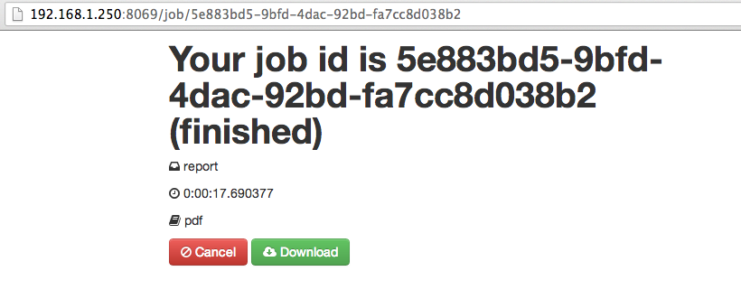

# Async Reports for OpenERP

## How to install

1. Install dependencies

  ```sh
  $ pip install -r async_reports/requirements.txt
  ```

2. Install [oorq](https://github.com/gisce/ooor) module
2. Put the module in your OpenERP $ADDONS_PATH
3. Install the module

## Screenshot



## Demo

https://www.youtube.com/watch?v=TPh3kEfda9A
